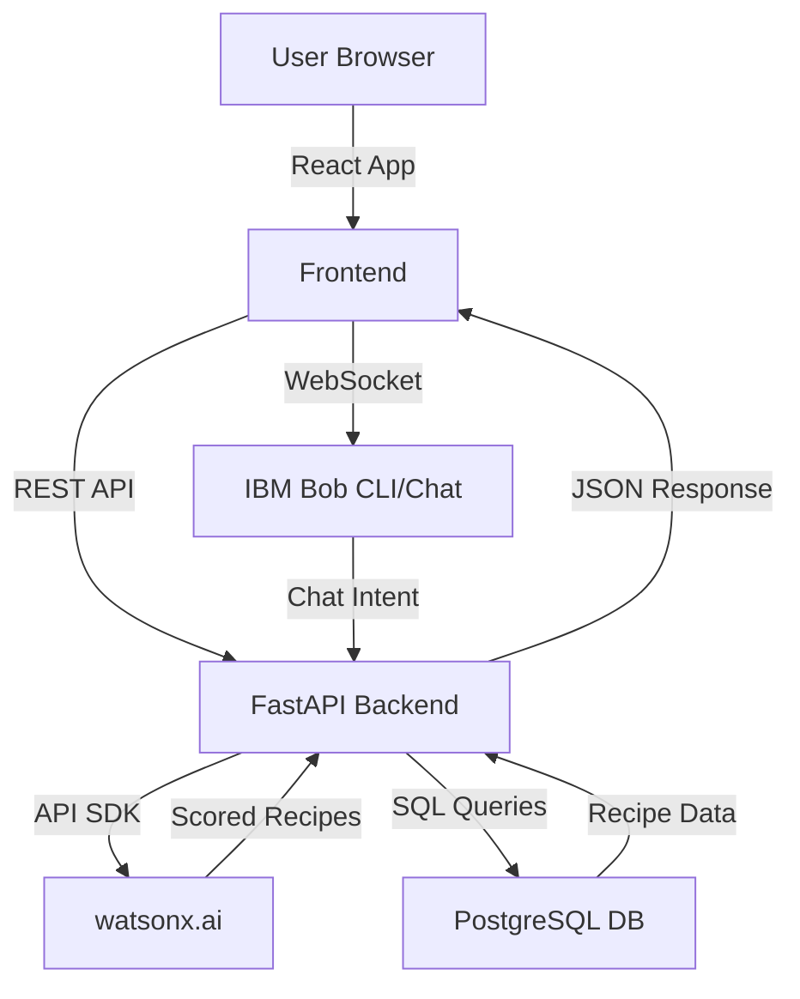

# Architecture

## System Architecture

Our system architecture is designed for low latency and high scalability, leveraging modern web frameworks and robust AI inference.

## Components

| Component | Technology | Responsibility |
|---|---|---|
| Frontend | React 18 | Dashboard UI, user preference forms, rendering recommended meal cards |
| Backend API | FastAPI | Business logic, handling user intents, orchestration of ML and DB calls |
| Chat Interface | IBM Bob | Managing conversation state and natural language understanding for user queries |
| ML Engine | watsonx.ai | Scoring recipes against user dietary constraints and generating reasoning |
| Database | PostgreSQL | Storing recipe datasets, user profiles, and historical feedback |

## Data Flow

Data flows seamlessly from the user to the database and back, enriched by AI at the core:

1. The user inputs a query (e.g., "I want a vegan dinner") via the IBM Bob chat interface embedded in the React frontend.
2. The frontend sends the parsed intent to the FastAPI backend.
3. The backend retrieves the user's stored profile (dietary restrictions, allergies) from PostgreSQL.
4. The backend pulls a candidate set of recipes from PostgreSQL based on basic tags.
5. The backend formats a prompt containing the candidate recipes and user profile, sending it to the watsonx.ai inference endpoint.
6. watsonx.ai returns a scored list of recipes with natural language reasoning (e.g., "This tofu stir-fry is perfect because it's vegan and high in protein").
7. The backend returns the final JSON to the frontend for display.

## Security Considerations

Security is built-in from the ground up:

- API keys for watsonx.ai and database credentials are stored exclusively in environment variables and are never committed to version control.
- All backend routes are protected and validate incoming payloads using Pydantic models.
- User profiles are pseudonymized, minimizing PII exposure.

## Scalability Notes

The prototype is designed to scale:

- The FastAPI backend is entirely stateless, allowing it to be horizontally scaled behind a load balancer.
- PostgreSQL connections are managed via a connection pool (e.g., PgBouncer) to handle high concurrency.
- Future versions will implement Redis caching for frequent queries (e.g., "popular vegan breakfasts") to reduce the load on the watsonx.ai endpoints.
