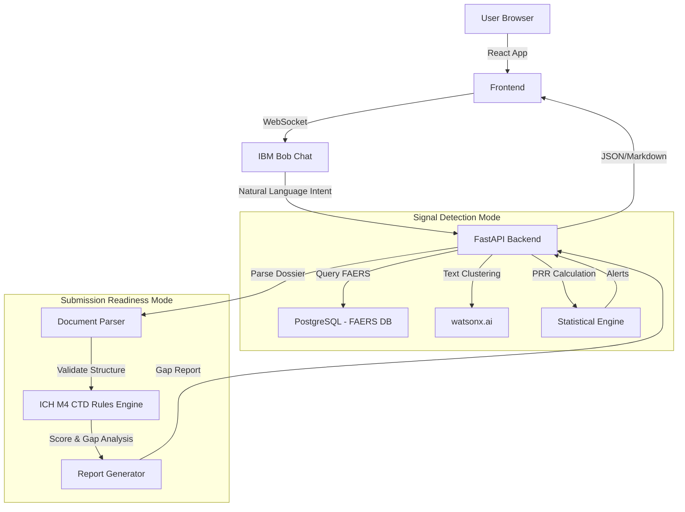

# Architecture

## System Architecture

Our architecture handles heavy data ingestion and processing, bridging structured statistical analysis with NLP.

## Components

| Component | Technology | Responsibility |
|---|---|---|
| Frontend | React 18 | Dashboard UI, data visualization for signals, and gap report rendering |
| Backend API | FastAPI | Orchestration of modes, running PRR calculations, handling file uploads |
| Chat Interface | IBM Bob | Managing user requests (e.g., "Analyze drug X", "Check dossier Y") |
| ML Engine | watsonx.ai | Clustering unstructured FAERS narratives |
| Database | PostgreSQL | Storing the massive FAERS dataset and the ICH M4 CTD rule hierarchy |

## Data Flow

1. **Signal Detection:** 
   - FAERS data is continuously ingested into PostgreSQL.
   - Background tasks run PRR calculations. 
   - When a user asks IBM Bob about a drug, the backend fetches PRR scores and uses watsonx.ai to cluster the underlying narratives to explain the signal.
2. **Submission Readiness:**
   - A user uploads a dossier outline (e.g., JSON or structured text).
   - The FastAPI backend parses the outline against the ICH M4 rules stored in the DB.
   - A completeness score is generated and passed back to the frontend alongside a detailed gap report.

## Security Considerations

- CTD Dossiers are highly confidential. Uploaded outlines are processed entirely in memory and are never persisted to disk or external logs.
- API keys for watsonx.ai are stored securely in environment variables.

## Scalability Notes

- Calculating PRR across 20M+ records is computationally expensive. We utilize materialized views in PostgreSQL to pre-aggregate adverse event counts by drug.
- The document parser is designed to handle 100,000+ page structures by processing them in chunks using async workers.
